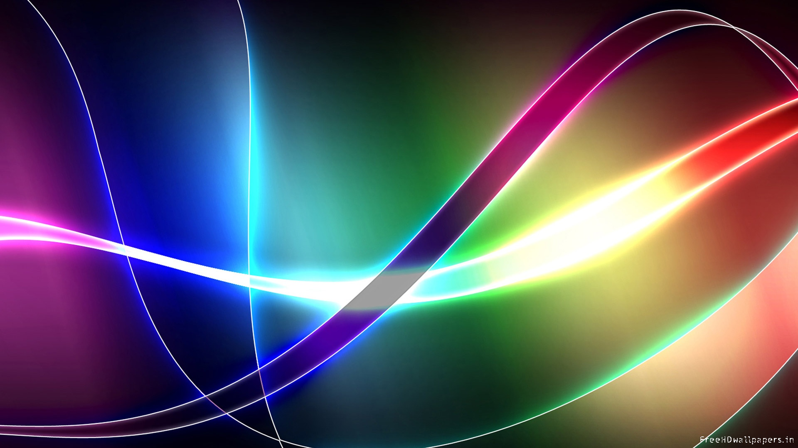
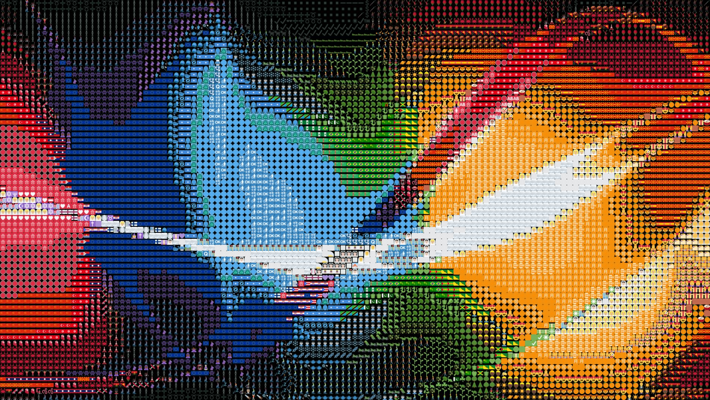
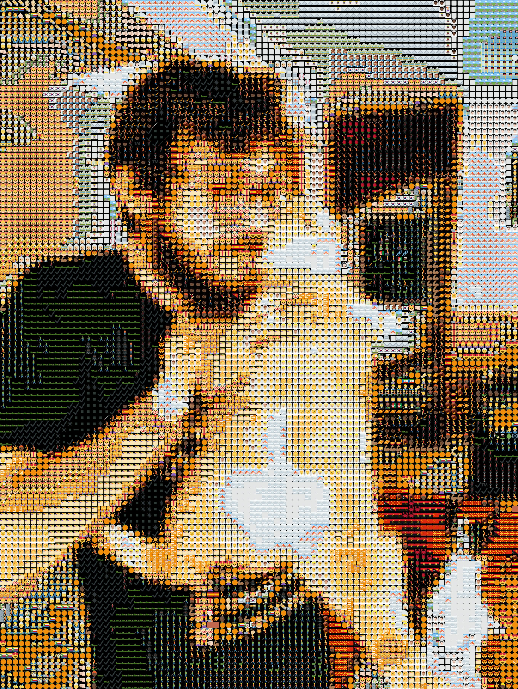

# 😀 xoxo-picture 😀

Convert your pictures into emojis pictures !

## Help

```
xoxo-picture 1.0
GLCraft
Convert picture into Emoji picture!

USAGE:
    xoxo-picture.exe [OPTIONS] <filename>

ARGS:
    <filename>    Picture path

FLAGS:
    -h, --help       Prints help information
    -V, --version    Prints version information

OPTIONS:
        --assets <assets-path>    Emojis assets path [default: deps/twemoji/assets/72x72]
    -s, --size <size>             Size of an emoji [default: 8]
    -u, --upscale <upscale>       Emoji upscale [default: 1]
```

## Examples

<style>
.center {
    display: block;
    margin-left: auto;
    margin-right: auto;
    width: 1200px;
    /* width:50%; */
}
.img {
    width:50%;
    border-radius: 40px;
    text-align: center;

}
</style>
<div class="center"></div>

<div class="center"></div>

<div class="center"></div>

<div class="center"></div>

## Notes

Special thanks to Ino for the idea of the octree ;)